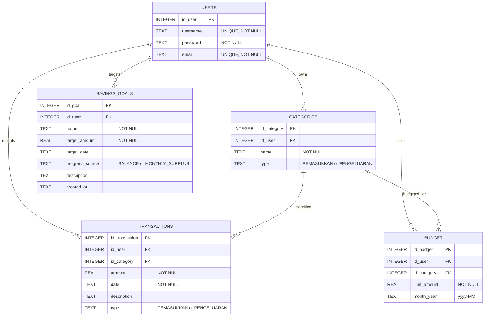

# Dokumentasi Struktur Project dan ERD Database

Project ini adalah aplikasi desktop pencatatan keuangan pribadi berbasis Java, JavaFX, FXML, CSS, Maven, SQLite, dan JDBC. Arsitektur yang digunakan mendekati pola MVC dengan pemisahan tampilan, controller, model, DAO, utility, dan validasi.

## 1. Struktur Project

```text
Pencatatan_Keuangan/
|-- .mvn/wrapper/
|   |-- maven-wrapper.jar
|   `-- maven-wrapper.properties
|-- src/
|   |-- main/
|   |   |-- java/
|   |   |   |-- module-info.java
|   |   |   `-- com/app/uangku/
|   |   |       |-- Launcher.java
|   |   |       |-- HelloApplication.java
|   |   |       |-- HelloController.java
|   |   |       |-- component/
|   |   |       |-- controller/
|   |   |       |-- dao/
|   |   |       |-- model/
|   |   |       |-- util/
|   |   |       `-- validation/
|   |   `-- resources/
|   |       `-- com/app/uangku/
|   |           |-- fxml/
|   |           |-- css/
|   |           |-- fonts/
|   |           |-- icons/
|   |           `-- hello-view.fxml
|   `-- test/
|       `-- java/com/app/uangku/
|-- identifier.sqlite
|-- pom.xml
|-- mvnw
|-- mvnw.cmd
|-- README.md
`-- Laporan_Perancangan_App_PrakRPL.pdf
```

## 2. Fungsi Folder dan File Utama

### Root Project

| File/Folder | Fungsi |
|---|---|
| `pom.xml` | Konfigurasi Maven, dependency JavaFX, SQLite JDBC, JUnit, compiler Java 17, dan plugin JavaFX. |
| `mvnw`, `mvnw.cmd` | Maven Wrapper agar project bisa dijalankan tanpa instalasi Maven global. |
| `.mvn/wrapper/` | File pendukung Maven Wrapper. |
| `identifier.sqlite` | File database SQLite lokal yang dipakai aplikasi saat ini. |
| `README.md` | Dokumentasi umum project, fitur, rencana database, dan pembagian tugas. |
| `Laporan_Perancangan_App_PrakRPL.pdf` | Dokumen perancangan/laporan pendukung, tidak dipakai langsung oleh aplikasi. |

### `src/main/java`

| File/Folder | Fungsi |
|---|---|
| `module-info.java` | Deklarasi module Java. Membuka package controller ke JavaFX FXML dan menambahkan dependency `java.sql`, JavaFX, dan SQLite JDBC. |
| `Launcher.java` | Entry point tambahan yang memanggil `HelloApplication.main()`. Berguna untuk menjalankan aplikasi dari hasil packaging atau IDE tertentu. |
| `HelloApplication.java` | Class utama JavaFX. Menyiapkan database, menjalankan dummy seeder, memuat `login.fxml`, membuat scene, dan menampilkan stage aplikasi. |
| `HelloController.java` | Sisa template JavaFX. Hanya terhubung ke `hello-view.fxml` dan tidak dipakai dalam alur aplikasi saat ini. |

### Package `component`

| File | Fungsi |
|---|---|
| `SvgIcon.java` | Komponen custom untuk menampilkan icon SVG di FXML, terutama pada sidebar, logo, dan navigasi. |

### Package `controller`

Controller menghubungkan FXML dengan logika aplikasi. Controller menerima input user, menjalankan validasi, memanggil DAO, lalu memperbarui tampilan.

| File | Fungsi |
|---|---|
| `BaseWireframeController.java` | Controller dasar untuk navigasi antar halaman, logout, format rupiah, parsing bulan, parsing nominal, pesan sukses/error, dan dialog konfirmasi. |
| `AuthController.java` | Mengatur login dan register. Memvalidasi input, membuat user, login user, membuat kategori default, menyimpan session, dan pindah ke dashboard. |
| `DashboardController.java` | Menampilkan ringkasan keuangan: saldo, pemasukan, pengeluaran, transaksi terbaru, dan ringkasan budget bulan berjalan. |
| `TransactionController.java` | Mengatur CRUD transaksi, filter transaksi, pemilihan kategori, tanggal, tipe transaksi, dan tabel riwayat transaksi. |
| `CategoryController.java` | Mengatur CRUD kategori pemasukan/pengeluaran dan mencegah penghapusan kategori yang masih dipakai transaksi. |
| `BudgetController.java` | Mengatur anggaran bulanan per kategori pengeluaran, update budget, hapus budget, progress pemakaian, dan status budget. |
| `SavingsGoalController.java` | Mengatur target tabungan, sumber progress, target nominal, target tanggal, status progress, edit, dan hapus target. |
| `ReportController.java` | Mengatur laporan visual, terutama ringkasan pengeluaran berdasarkan kategori dan data untuk chart/laporan. |

### Package `dao`

DAO bertanggung jawab terhadap akses database SQLite. Semua koneksi memakai `DatabaseHelper.getConnection()`.

| File | Fungsi |
|---|---|
| `UserDAO.java` | Register user, login user, cari user berdasarkan username/email, cek username, dan cek email. |
| `CategoryDAO.java` | Tambah, ubah, hapus, ambil kategori per user, ambil kategori per tipe, cek duplikasi kategori, dan buat kategori default. |
| `TransactionDAO.java` | Tambah, ubah, hapus, ambil transaksi, filter transaksi, ambil transaksi terbaru, hitung pemasukan, pengeluaran, saldo, dan data pengeluaran per kategori. |
| `BudgetDAO.java` | Set budget, update budget, hapus budget, ambil budget per user/bulan, ambil budget per kategori/bulan, dan hitung pemakaian budget dari transaksi. |
| `SavingsGoalDAO.java` | Tambah, ubah, hapus, ambil target tabungan, ambil target per ID, dan menghitung current amount berdasarkan saldo atau surplus bulanan. |

### Package `model`

Model merepresentasikan data utama aplikasi dan sebagian logika status sederhana.

| File | Fungsi |
|---|---|
| `User.java` | Model user: `idUser`, `username`, `password`, `email`. |
| `Category.java` | Model kategori: `idCategory`, `idUser`, `name`, `type`. |
| `Transaction.java` | Model transaksi: `idTransaction`, `idUser`, `idCategory`, `amount`, `date`, `description`, `type`, `categoryName`. |
| `TransactionType.java` | Enum tipe transaksi: pemasukan dan pengeluaran. Nilai database saat ini memakai `PEMASUKKAN` dan `PENGELUARAN`. |
| `Budget.java` | Model budget: `idBudget`, `idUser`, `idCategory`, `limitAmount`, `monthYear`, `categoryName`, `usedAmount`, persentase pemakaian, dan status budget. |
| `BudgetStatus.java` | Enum status budget: aman, mendekati limit, melebihi limit. |
| `SavingsGoal.java` | Model target tabungan: `idGoal`, `idUser`, `name`, `targetAmount`, `targetDate`, `progressSource`, `description`, `createdAt`, `currentAmount`, progress, sisa target, dan status. |
| `SavingsGoalSource.java` | Enum sumber progress target tabungan: saldo saat ini atau surplus bulan ini. |
| `SavingsGoalStatus.java` | Enum status target tabungan: on track, mendekati target, tercapai. |

### Package `util`

| File | Fungsi |
|---|---|
| `DatabaseHelper.java` | Menyimpan URL database `jdbc:sqlite:identifier.sqlite`, membuka koneksi SQLite, mengaktifkan foreign key, dan membuat tabel jika belum ada. |
| `DummyDataSeeder.java` | Membuat akun demo, kategori default, transaksi dummy, budget dummy, dan target tabungan demo. Dipanggil saat aplikasi start. |
| `PasswordUtil.java` | Hash dan verifikasi password. |
| `SceneManager.java` | Membuat scene, berpindah halaman FXML, memuat semua CSS global, dan memuat font Poppins. |
| `SessionManager.java` | Menyimpan user aktif selama aplikasi berjalan dan menghapus session saat logout. |

### Package `validation`

| File | Fungsi |
|---|---|
| `ValidationResult.java` | Objek hasil validasi: valid/tidak valid dan pesan error. |
| `AuthInputValidator.java` | Validasi input login dan register. |
| `CategoryInputValidator.java` | Validasi form kategori. |
| `TransactionInputValidator.java` | Validasi form transaksi dan filter tanggal. |
| `BudgetInputValidator.java` | Validasi input budget. |
| `SavingsGoalInputValidator.java` | Validasi input target tabungan. |

### `src/main/resources`

| Folder/File | Fungsi |
|---|---|
| `fxml/login.fxml` | Tampilan login. |
| `fxml/register.fxml` | Tampilan register. |
| `fxml/dashboard.fxml` | Tampilan dashboard ringkasan keuangan. |
| `fxml/transactions.fxml` | Tampilan transaksi dan filter transaksi. |
| `fxml/categories.fxml` | Tampilan manajemen kategori. |
| `fxml/budgets.fxml` | Tampilan budget bulanan. |
| `fxml/goals.fxml` | Tampilan target tabungan. |
| `fxml/reports.fxml` | Tampilan laporan visual. |
| `css/*.css` | Styling global dan styling per halaman. Semua CSS dimuat lewat `SceneManager`. |
| `fonts/*.ttf` | Font Poppins yang dimuat oleh `SceneManager`. |
| `icons/*.svg` | Icon SVG untuk logo dan navigasi sidebar. |
| `hello-view.fxml` | Sisa template JavaFX, tidak dipakai dalam alur aplikasi saat ini. |

## 3. Alur Kerja Aplikasi

```text
Launcher
  -> HelloApplication
      -> DatabaseHelper.initializeDatabase()
      -> DummyDataSeeder.seedIfEmpty()
      -> load login.fxml
      -> AuthController
          -> login/register
          -> SessionManager menyimpan user aktif
          -> dashboard.fxml
              -> DashboardController
              -> navigasi ke transaksi, kategori, budget, target tabungan, laporan
```

Alur akses data:

```text
FXML -> Controller -> Validator -> DAO -> DatabaseHelper -> SQLite identifier.sqlite
```

## 4. Struktur Database

Database memakai SQLite lokal dengan file `identifier.sqlite`. Schema dibuat otomatis oleh `DatabaseHelper` saat aplikasi dijalankan.

### Tabel `users`

Menyimpan data akun pengguna.

| Kolom | Tipe | Keterangan |
|---|---|---|
| `id_user` | INTEGER | Primary key, auto increment. |
| `username` | TEXT | Username user, wajib unik. |
| `password` | TEXT | Password yang sudah di-hash. |
| `email` | TEXT | Email user, wajib unik. |

### Tabel `categories`

Menyimpan kategori transaksi milik masing-masing user.

| Kolom | Tipe | Keterangan |
|---|---|---|
| `id_category` | INTEGER | Primary key, auto increment. |
| `id_user` | INTEGER | Foreign key ke `users.id_user`. |
| `name` | TEXT | Nama kategori, misalnya Gaji, Makanan, Transportasi. |
| `type` | TEXT | Tipe kategori, hanya `PEMASUKKAN` atau `PENGELUARAN`. |

### Tabel `transactions`

Menyimpan transaksi pemasukan dan pengeluaran.

| Kolom | Tipe | Keterangan |
|---|---|---|
| `id_transaction` | INTEGER | Primary key, auto increment. |
| `id_user` | INTEGER | Foreign key ke `users.id_user`. |
| `id_category` | INTEGER | Foreign key ke `categories.id_category`. |
| `amount` | REAL | Nominal transaksi. |
| `date` | TEXT | Tanggal transaksi dalam format teks, dipakai sebagai `LocalDate` di Java. |
| `description` | TEXT | Deskripsi transaksi, boleh kosong. |
| `type` | TEXT | Tipe transaksi, hanya `PEMASUKKAN` atau `PENGELUARAN`. |

### Tabel `budget`

Menyimpan batas anggaran bulanan per kategori pengeluaran.

| Kolom | Tipe | Keterangan |
|---|---|---|
| `id_budget` | INTEGER | Primary key, auto increment. |
| `id_user` | INTEGER | Foreign key ke `users.id_user`. |
| `id_category` | INTEGER | Foreign key ke `categories.id_category`. |
| `limit_amount` | REAL | Batas budget untuk kategori tertentu. |
| `month_year` | TEXT | Bulan dan tahun budget, format `yyyy-MM`, misalnya `2026-05`. |

### Tabel `savings_goals`

Menyimpan target tabungan user.

| Kolom | Tipe | Keterangan |
|---|---|---|
| `id_goal` | INTEGER | Primary key, auto increment. |
| `id_user` | INTEGER | Foreign key ke `users.id_user`. |
| `name` | TEXT | Nama target tabungan. |
| `target_amount` | REAL | Nominal target yang ingin dicapai. |
| `target_date` | TEXT | Tanggal target, boleh kosong. |
| `progress_source` | TEXT | Sumber perhitungan progress, `BALANCE` atau `MONTHLY_SURPLUS`. |
| `description` | TEXT | Deskripsi target, boleh kosong. |
| `created_at` | TEXT | Tanggal data dibuat, default `date('now')`. |

## 5. Relasi Database

| Relasi | Kardinalitas | Penjelasan |
|---|---|---|
| `users` -> `categories` | 1 ke banyak | Satu user dapat memiliki banyak kategori. Satu kategori hanya milik satu user. |
| `users` -> `transactions` | 1 ke banyak | Satu user dapat memiliki banyak transaksi. Satu transaksi hanya milik satu user. |
| `categories` -> `transactions` | 1 ke banyak | Satu kategori dapat dipakai banyak transaksi. Satu transaksi memakai satu kategori. |
| `users` -> `budget` | 1 ke banyak | Satu user dapat membuat banyak budget bulanan. Satu budget hanya milik satu user. |
| `categories` -> `budget` | 1 ke banyak | Satu kategori dapat memiliki budget untuk beberapa bulan. Satu budget mengacu ke satu kategori. |
| `users` -> `savings_goals` | 1 ke banyak | Satu user dapat memiliki banyak target tabungan. Satu target tabungan hanya milik satu user. |

## 6. Diagram ERD



## 7. Penjelasan ERD untuk Presentasi

Database aplikasi UangKu dirancang berbasis user. Tabel utama adalah `users`, karena setiap data kategori, transaksi, budget, dan target tabungan selalu terhubung ke user tertentu melalui `id_user`. Dengan desain ini, data antar user tidak bercampur.

Tabel `categories` menyimpan kategori milik user. Kategori dibedakan berdasarkan tipe, yaitu pemasukan atau pengeluaran. Kategori ini kemudian dipakai oleh tabel `transactions` untuk mengelompokkan setiap transaksi.

Tabel `transactions` menyimpan seluruh pemasukan dan pengeluaran. Setiap transaksi memiliki nominal, tanggal, deskripsi, tipe transaksi, user pemilik, dan kategori. Dari tabel ini aplikasi menghitung saldo, total pemasukan, total pengeluaran, laporan per kategori, dan pemakaian budget.

Tabel `budget` menyimpan batas anggaran bulanan untuk kategori tertentu. Karena budget memiliki `id_user`, `id_category`, dan `month_year`, maka user bisa membuat budget berbeda untuk setiap kategori pada bulan yang berbeda. Nilai pemakaian budget tidak disimpan langsung, tetapi dihitung dari total transaksi pengeluaran pada kategori dan bulan yang sama.

Tabel `savings_goals` menyimpan target tabungan user. Progress target tidak disimpan sebagai angka tetap di database. Progress dihitung oleh aplikasi berdasarkan `progress_source`, yaitu dari saldo saat ini atau surplus bulan berjalan. Dengan cara ini, progress target selalu mengikuti data transaksi terbaru.

## 8. Catatan Teknis

| Catatan | Penjelasan |
|---|---|
| Nama tabel budget | Implementasi aktual memakai tabel `budget`, bukan `budgets`. |
| Nilai pemasukan | Schema memakai `PEMASUKKAN`, sedangkan istilah Indonesia yang lebih tepat adalah `PEMASUKAN`. Kode enum masih menerima keduanya saat membaca data. |
| File template | `HelloController.java` dan `hello-view.fxml` adalah sisa template JavaFX dan tidak masuk alur aplikasi aktif. |
| Dummy data | `DummyDataSeeder` dipanggil saat aplikasi start. Cocok untuk demo, tetapi untuk versi final sebaiknya dipertimbangkan apakah tetap diperlukan. |
| Database lokal | `identifier.sqlite` adalah database lokal. Jika project dibagikan ke banyak anggota, file database sebaiknya tidak menjadi sumber kebenaran utama karena data tiap komputer bisa berbeda. |

